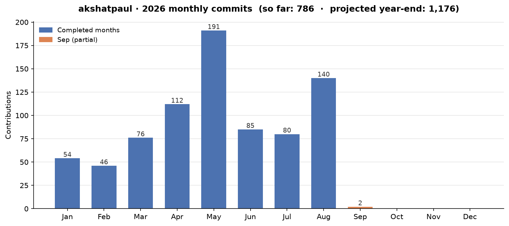

<h1 align="center">Hi, I'm Akshat Paul 👋</h1>

  <b>Author · Developer · Speaker · Entrepreneur</b> 
  Founder &amp; CTO at <a href="https://company360.in">Company360.in</a> — building AI-powered organizations. 
  Technologist from India with deep experience across mobile, web and DevOps. 
  Author of 5 technical books, technical reviewer on 5 more, and a regular speaker at international conferences.

  
  
  
  
  

---

## 🛠️ Tech Stack

**Languages &amp; Frameworks**

**Cloud &amp; DevOps**

**AI Engineering**

**Also working with**

---

## 📚 Publications

**As Author**

| Year | Title | Publisher |
|------|-------|-----------|
| 2023 | Serverless Web Applications with AWS Amplify | Apress |
| 2019 | The Ruby Workshop | Packt |
| 2019 | React Native for Mobile Development | Apress |
| 2016 | React Native for iOS Development | Apress |
| 2013 | RubyMotion iOS Development Essentials | Packt |

**As Technical Reviewer**

| Year | Title | Publisher |
|------|-------|-----------|
| 2022 | Creating Apps with React Native | Apress |
| 2021 | The Ruby Workshop | Packt |
| 2019 | Practical React Native | Apress |
| 2018 | Microservices in Action | Manning |
| 2015 | Introduction to React | Apress |

Full details on <a href="https://www.akshatpaul.com">akshatpaul.com/publications</a>.

---

## 🎤 Selected Talks &amp; Interviews

| Year | Talk | Event |
|------|------|-------|
| 2026 | Building AI-Powered Organizations: Agentic AI for Enterprises (keynote) | CIO/CXO Roundtable — The AI World Organization × Rabbitt AI, Gurugram |
| 2025 | Making Mobile Animations Effortless with Skia and React Native | React Global Online Summit '25 |
| 2024 | Skia Meets React Native: Revolutionizing Mobile UIs &amp; Animations | React Universe Conference, Wrocław |
| 2023 | Supercharge Your Web Development with React &amp; AWS Amplify (workshop) | Online |
| 2023 | Debug Ruby on Rails Apps Like a Ninja | Online |
| 2022 | Building Serverless Apps with React &amp; AWS Amplify | React Global Summit |
| 2021 | Real-Time Video Communication with React &amp; WebRTC | React Global Summit |
| 2021 | A Case for Microinteractions &amp; Animations in Mobile Apps with React Native | React JS Case Study Festival |
| 2020 | Building Apps Not for Many but for All: Accessibility with React Native | Cross Platform Mobile Summit |
| 2020 | Let's Go 3D with React Native (AR/VR) | React Native EU |
| 2017 | Microservices, Containers &amp; Kubernetes at Scale | DevOps@Scale, Amsterdam |
| 2013–14 | Keynote: Testing Strategies &amp; TDD | CIO Matrix, Bangkok &amp; Kuala Lumpur |

See the full list of talks, interviews and panels on <a href="https://www.akshatpaul.com">akshatpaul.com/talks-interviews</a>.

---

## 🚀 What I'm Working On

- 🤖 **AI engineering, in writing and talks** — Model Context Protocol, context engineering and agentic loops. Recent posts: [How MCP Actually Works](https://www.akshatpaul.com/how-mcp-actually-works), [MCP: Tools vs Resources vs Prompts](https://www.akshatpaul.com/mcp-tools-vs-resources-vs-prompts), [The NxM Problem](https://www.akshatpaul.com/nxm-problem-why-ai-integrations-were-broken-before-mcp), [MCP vs ADK](https://www.akshatpaul.com/mcp-vs-adk-whats-the-difference), [Context Engineering Explained](https://www.akshatpaul.com/context-engineering-explained).
- 🎨 **High-performance React Native animations with Skia** — the theme of my 2024–25 conference talks.
- 🧑‍🏫 **React Native workshop material &amp; demos** — [`rneu21`](https://github.com/akshatpaul/rneu21), [`rnu-sprinklesdemo`](https://github.com/akshatpaul/rnu-sprinklesdemo), [`rgs-nov21`](https://github.com/akshatpaul/rgs-nov21).
- 🕶️ **AR / 3D experiments with React Native** — [`ar-rn-example`](https://github.com/akshatpaul/ar-rn-example).

---

## 📈 Commit Activity

  

<!-- STATS:START -->
- **Commits so far (2026):** 786 over 244 days
- **Daily average:** 3.22 commits/day
- **Projected 2026 year-end total:** 1,176 commits

_Last updated: 2026-09-01 12:37 UTC_
<!-- STATS:END -->

  
  

---

  <a href="https://www.akshatpaul.com">www.akshatpaul.com</a> · Thanks for stopping by!

